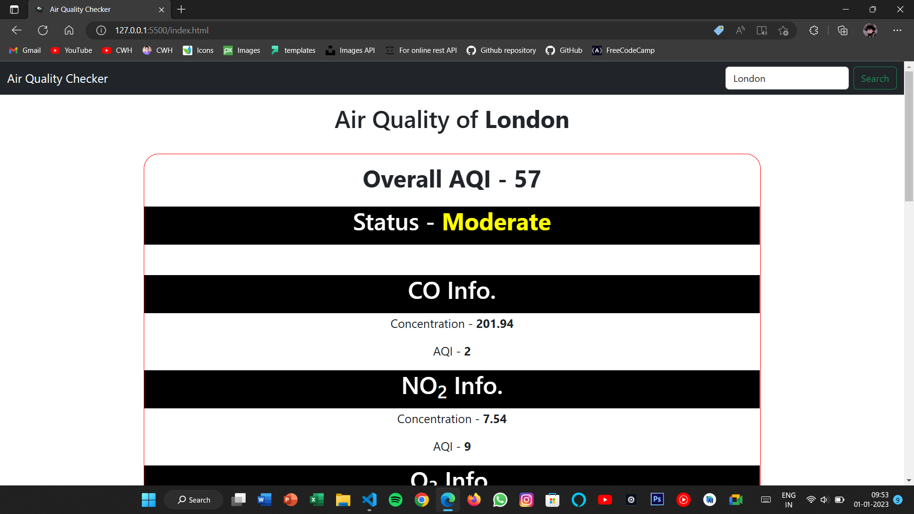
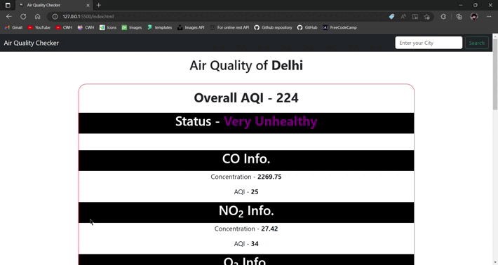

# Created an AQI checker using HTML, CSS and Javascript. API source - https://rapidapi.com/apininjas/api/air-quality-by-api-ninjas/

# Link of AQI Checker - https://rahulgit24.github.io/AQI_Check/

<h3> This web application is able to fetch the query with a vary small latency </h3>

<h3> It works quite well on mobile phones and various other devices as it is responsive.</h3>

<h3> Soon I will make some changes in it to make it more interactive.</h3>

# Working of this Project

<h3> Connect with Author</h3>

